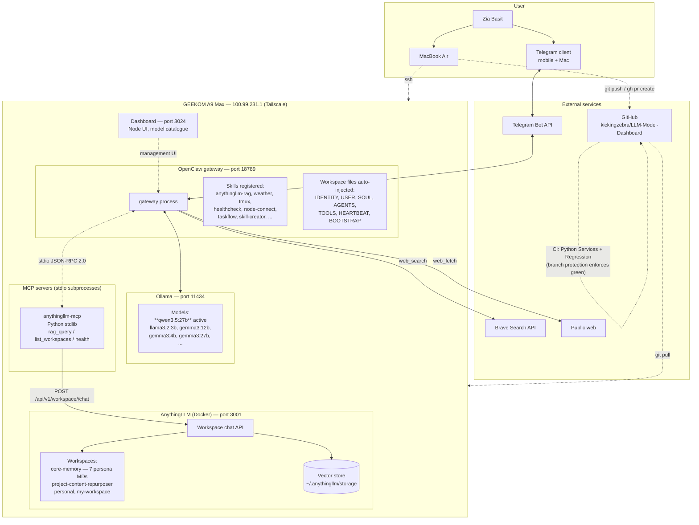
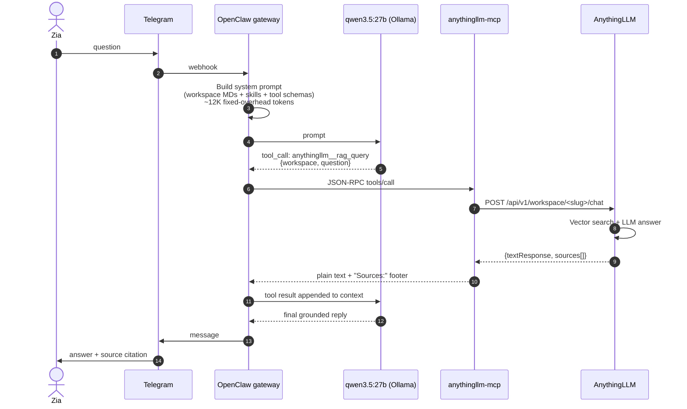
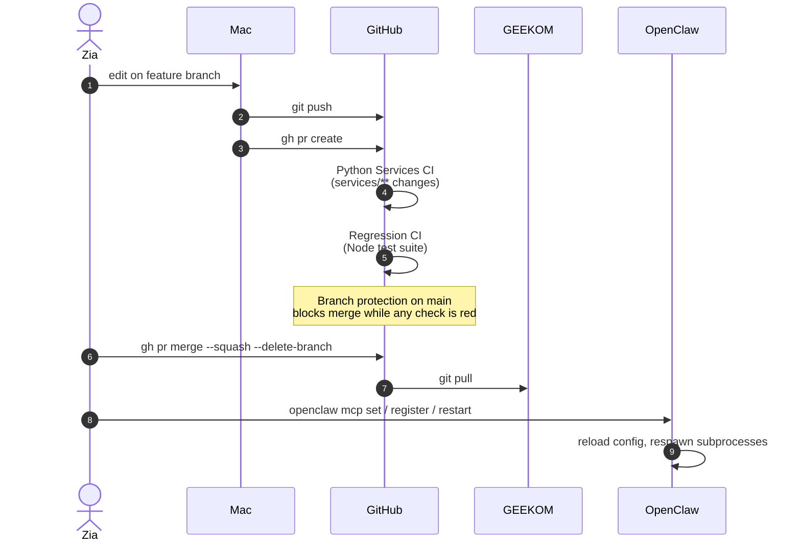

# OpenClaw / Noor — System Architecture

Snapshot as of 2026-04-22. Reflects state after the `anythingllm-mcp` PR (#1), Regression CI fix (#2), and dashboard schema rescue PR (#3) merged on 2026-04-21.

Diagrams use Mermaid — render natively on GitHub, VS Code, and most markdown viewers.

---

## 1. High-level architecture



---

## 2. Message flow — typical RAG query

Example prompt: *"What's in my Content Repurposer project growth strategy?"*



---

## 3. Deploy flow — Mac → GEEKOM via GitHub

Every code change follows this path. `scp` is reserved for throwaway smoke tests.



---

## 4. Component inventory

### Hosted on GEEKOM A9 Max (Ryzen AI 9 HX 370, 64 GB unified RAM, iGPU only)

| Component | Port | Role | Lifecycle |
|---|---|---|---|
| OpenClaw gateway | 18789 | Orchestrator — injects prompt, bridges Telegram ↔ Ollama ↔ MCP ↔ tools | systemd user service |
| Ollama | 11434 | Local LLM provider. Active: qwen3.5:27b. Also: llama3.2:3b, gemma3:{4,12,27}b, codegemma:7b, nemotron-mini:4b, qwen3:8b | systemd |
| AnythingLLM (Docker) | 3001 | RAG knowledge base. Web UI + API. `anythingllm` container | Docker |
| Dashboard | 3024 | Node UI for managing the Ollama model catalogue | systemd user service |
| `anythingllm-mcp` | stdio | MCP bridge from OpenClaw to AnythingLLM API | spawned on demand by OpenClaw |

### External services

| Component | Role |
|---|---|
| Telegram Bot API | Message transport. Bot handle: `@Noor_geekom_bot` |
| GitHub | Source of truth for Mac → GEEKOM deploys. Branch protection on `main` requires CI green |
| Brave Search API | Backs `web_search` tool |

### OpenClaw workspace files (auto-injected into every turn, ~3.9K tokens)

| File | Purpose |
|---|---|
| `IDENTITY.md` | Noor's persona, name, runtime, capability statement |
| `USER.md` | Who Zia is — projects, hardware, preferences |
| `SOUL.md` | Values, tone, communication style |
| `AGENTS.md` | Agent catalogue, inter-agent contracts |
| `TOOLS.md` | Tool philosophy and defaults |
| `HEARTBEAT.md` | Session rhythm, cadence hints |
| `BOOTSTRAP.md` | Cold-start context loader |

### AnythingLLM workspaces

| Slug | Contents | LLM | Mode |
|---|---|---|---|
| `core-memory` | 7 persona MDs (AGENTS, SOUL, IDENTITY, USER, TOOLS, HEARTBEAT, BOOTSTRAP) | llama3.2:3b | chat |
| `project-content-repurposer` | AI Content Repurposer overview + growth strategy | llama3.2:3b | chat |
| `personal` | (empty, no LLM configured) | — | — |
| `my-workspace` | Default catchall | default | default |

### Noor's active tools (as surfaced via `/context list`)

| Tool | Source | Notes |
|---|---|---|
| `web_search` | OpenClaw built-in | Brave provider |
| `web_fetch` | OpenClaw built-in | HTTPS only — private IPs blocked by SSRF protection |
| `anythingllm__rag_query` | MCP | Grounded RAG against a named workspace |
| `anythingllm__list_workspaces` | MCP | Discovery |
| `anythingllm__health` | MCP | Reachability check |

### Repo layout (openclaw-dashboard)

```
openclaw-dashboard/
├── .github/workflows/
│   ├── python-services.yml    # Python 3.10-3.12 matrix, triggers on services/**
│   └── regression.yml          # Node 22+24 matrix, repo-wide
├── services/
│   ├── anythingllm-mcp/        # MCP stdio server (the bridge)
│   │   ├── server.py
│   │   ├── anythingllm.py
│   │   ├── test_server.py       # 21 unit tests, mocked upstream
│   │   ├── test_integration.py  # 4 live tests, ANYTHINGLLM_INTEGRATION=1 gate
│   │   └── deploy.sh            # Mac → GEEKOM one-shot (scp exception, superseded by PR flow)
│   └── mcp-smoke/
│       └── echo.py              # reusable MCP viability probe
├── src/                         # Dashboard Node app
├── test/                        # Dashboard Node tests
├── scripts/                     # Regression + deploy helpers
└── docs/                        # Handoffs, reviews, this file
```

---

## 5. Known operational constraints

- **Telegram exec is intentionally gated off.** `tools.elevated.allowFrom.telegram` is false — no shell execution via Telegram. Any new capability Noor needs must come through MCP or a built-in tool, not bash.
- **Context budget ~32K per turn, ~12K fixed overhead** (system prompt + workspace files + skills text + tool schemas). Only ~20K is mutable conversation history.
- **AnythingLLM chat mode must be `chat` or `query` per workspace** — `automatic` forces agent-tool-use loop and causes JSON hallucination on small models.
- **Context reset with `/new`** drops all conversation history. Core-memory + workspace MDs reload on next turn.
- **MCP subprocess is spawned lazily** — first tool call after gateway restart pays ~50-100ms cold start; subsequent calls reuse the stdio pipe.

## 6. Known tech debt

- AnythingLLM API key `M71CQPK-...` is exposed in prior session notes (accepted, rotation deferred).
- GEEKOM filesystem copy of `anythingllm-mcp` predates main — next real deploy should `git pull` to sync with the merged bugfix version of `deploy.sh`.
- `fs_read` MCP tool deferred until AnythingLLM-upload friction justifies building it.
- Context Oracle (separate standalone sidecar at :3025, dev only) overlaps with AnythingLLM and is a candidate for deprecation.
