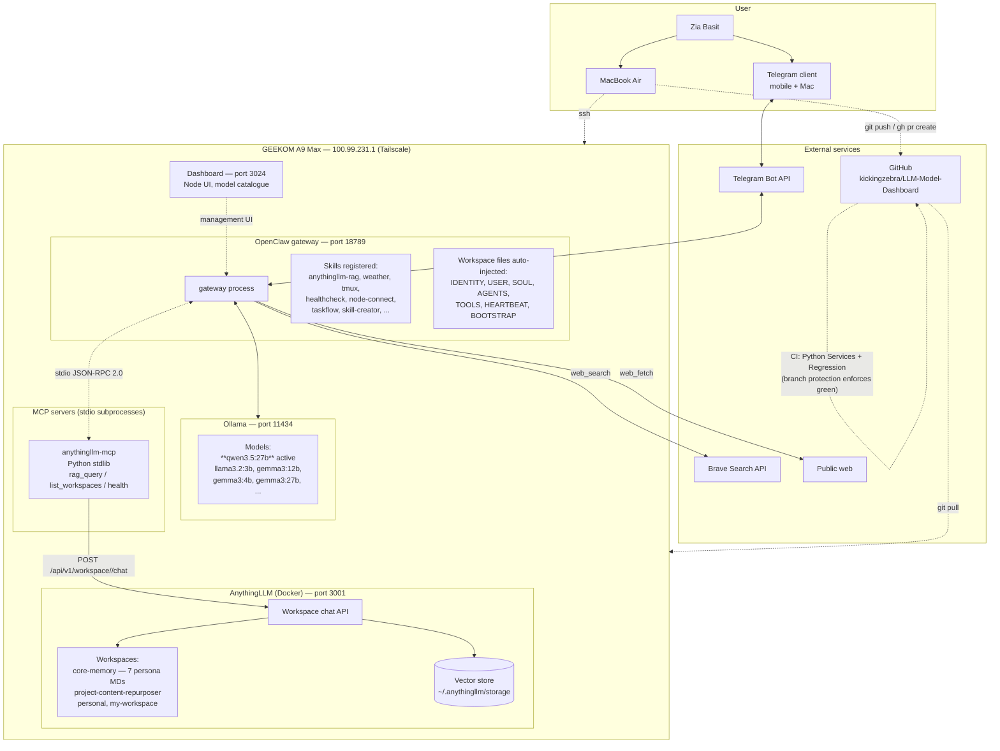
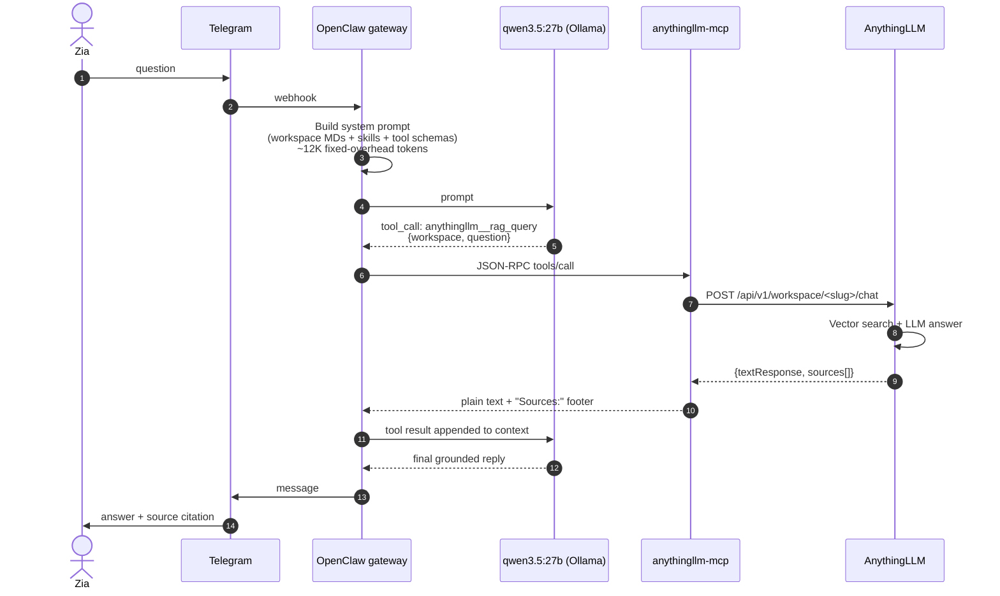
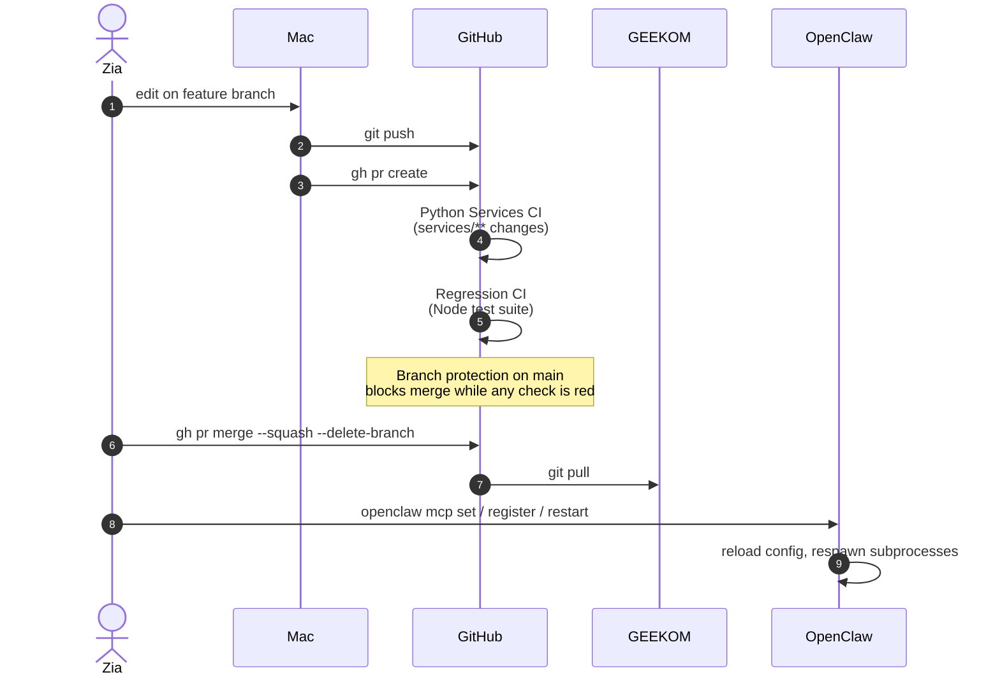
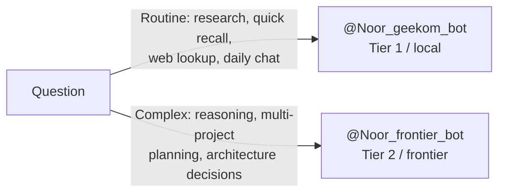

# OpenClaw / Noor — System Architecture

Snapshot as of 2026-04-22. Reflects state after the `anythingllm-mcp` PR (#1), Regression CI fix (#2), and dashboard schema rescue PR (#3) merged on 2026-04-21.

Diagrams use Mermaid — render natively on GitHub, VS Code, and most markdown viewers.

---

## 1. High-level architecture



---

## 2. Message flow — typical RAG query

Example prompt: *"What's in my Content Repurposer project growth strategy?"*



---

## 3. Deploy flow — Mac → GEEKOM via GitHub

Every code change follows this path. `scp` is reserved for throwaway smoke tests.



---

## 4. Component inventory

### Hosted on GEEKOM A9 Max (Ryzen AI 9 HX 370, 64 GB unified RAM, iGPU only)

| Component | Port | Role | Lifecycle |
|---|---|---|---|
| OpenClaw gateway | 18789 | Orchestrator — injects prompt, bridges Telegram ↔ Ollama ↔ MCP ↔ tools | systemd user service |
| Ollama | 11434 | Local LLM provider. Active: qwen3.5:27b. Also: llama3.2:3b, gemma3:{4,12,27}b, codegemma:7b, nemotron-mini:4b, qwen3:8b | systemd |
| AnythingLLM (Docker) | 3001 | RAG knowledge base. Web UI + API. `anythingllm` container | Docker |
| Dashboard | 3024 | Node UI for managing the Ollama model catalogue | systemd user service |
| `anythingllm-mcp` | stdio | MCP bridge from OpenClaw to AnythingLLM API | spawned on demand by OpenClaw |

### External services

| Component | Role |
|---|---|
| Telegram Bot API | Message transport. Bot handle: `@Noor_geekom_bot` |
| GitHub | Source of truth for Mac → GEEKOM deploys. Branch protection on `main` requires CI green |
| Brave Search API | Backs `web_search` tool |

### OpenClaw workspace files (auto-injected into every turn, ~3.9K tokens)

| File | Purpose |
|---|---|
| `IDENTITY.md` | Noor's persona, name, runtime, capability statement |
| `USER.md` | Who Zia is — projects, hardware, preferences |
| `SOUL.md` | Values, tone, communication style |
| `AGENTS.md` | Agent catalogue, inter-agent contracts |
| `TOOLS.md` | Tool philosophy and defaults |
| `HEARTBEAT.md` | Session rhythm, cadence hints |
| `BOOTSTRAP.md` | Cold-start context loader |

### AnythingLLM workspaces

| Slug | Contents | LLM | Mode |
|---|---|---|---|
| `core-memory` | 7 persona MDs (AGENTS, SOUL, IDENTITY, USER, TOOLS, HEARTBEAT, BOOTSTRAP) | llama3.2:3b | chat |
| `project-content-repurposer` | AI Content Repurposer overview + growth strategy | llama3.2:3b | chat |
| `personal` | (empty, no LLM configured) | — | — |
| `my-workspace` | Default catchall | default | default |

### Noor's active tools (as surfaced via `/context list`)

| Tool | Source | Notes |
|---|---|---|
| `web_search` | OpenClaw built-in | Brave provider |
| `web_fetch` | OpenClaw built-in | HTTPS only — private IPs blocked by SSRF protection |
| `anythingllm__rag_query` | MCP | Grounded RAG against a named workspace |
| `anythingllm__list_workspaces` | MCP | Discovery |
| `anythingllm__health` | MCP | Reachability check |

### Repo layout (openclaw-dashboard)

```
openclaw-dashboard/
├── .github/workflows/
│   ├── python-services.yml    # Python 3.10-3.12 matrix, triggers on services/**
│   └── regression.yml          # Node 22+24 matrix, repo-wide
├── services/
│   ├── anythingllm-mcp/        # MCP stdio server (the bridge)
│   │   ├── server.py
│   │   ├── anythingllm.py
│   │   ├── test_server.py       # 21 unit tests, mocked upstream
│   │   ├── test_integration.py  # 4 live tests, ANYTHINGLLM_INTEGRATION=1 gate
│   │   └── deploy.sh            # Mac → GEEKOM one-shot (scp exception, superseded by PR flow)
│   └── mcp-smoke/
│       └── echo.py              # reusable MCP viability probe
├── src/                         # Dashboard Node app
├── test/                        # Dashboard Node tests
├── scripts/                     # Regression + deploy helpers
└── docs/                        # Handoffs, reviews, this file
```

---

## 5. Known operational constraints

- **Telegram exec is intentionally gated off.** `tools.elevated.allowFrom.telegram` is false — no shell execution via Telegram. Any new capability Noor needs must come through MCP or a built-in tool, not bash.
- **Context budget ~32K per turn, ~12K fixed overhead** (system prompt + workspace files + skills text + tool schemas). Only ~20K is mutable conversation history.
- **AnythingLLM chat mode must be `chat` or `query` per workspace** — `automatic` forces agent-tool-use loop and causes JSON hallucination on small models.
- **Context reset with `/new`** drops all conversation history. Core-memory + workspace MDs reload on next turn.
- **MCP subprocess is spawned lazily** — first tool call after gateway restart pays ~50-100ms cold start; subsequent calls reuse the stdio pipe.

## 6. Known tech debt

- AnythingLLM API key `M71CQPK-...` is exposed in prior session notes (accepted, rotation deferred).
- GEEKOM filesystem copy of `anythingllm-mcp` predates main — next real deploy should `git pull` to sync with the merged bugfix version of `deploy.sh`.
- `fs_read` MCP tool deferred until AnythingLLM-upload friction justifies building it.
- Context Oracle (separate standalone sidecar at :3025, dev only) overlaps with AnythingLLM and is a candidate for deprecation.

---

## 7. Proposed: two-tier architecture (local + frontier)

Not yet built. Captured here so the shape is agreed before implementation. Dashed edges mark proposed components; solid boxes mark existing pieces that get reused.

### 7.1 Rationale

`qwen3.5:27b` running locally is good enough for routine research, web lookups, daily recall, and topic-scoped RAG. It is noticeably weaker than frontier models on complex reasoning, multi-project planning, and long-range synthesis. Rather than replace the local stack, add a second Telegram bot backed by a frontier API. Cost is controlled because the user — not an auto-router — decides which bot to message.

### 7.2 Component diagram

```mermaid
flowchart TB
    subgraph User["User on Telegram"]
        direction LR
        T1[Message in topic<br/>e.g. LinkedIn research]
        T2[Message in topic<br/>e.g. Strategy planning]
    end

    subgraph Bots["Telegram bots"]
        direction LR
        B1["@Noor_geekom_bot<br/>Tier 1 &mdash; local, fast, cheap"]
        B2["@Noor_frontier_bot<br/>Tier 2 &mdash; frontier, paid<br/>PROPOSED"]
    end

    subgraph Gateway["OpenClaw gateway (single instance, port 18789)"]
        Router["Message router<br/>1. which bot? &rarr; picks tier<br/>2. which topic? &rarr; picks workspace"]
        Prompt["Prompt builder<br/>injects 'default workspace = X' hint<br/>based on topic mapping"]
    end

    subgraph Models["Model providers"]
        direction LR
        Ollama["Ollama :11434<br/>qwen3.5:27b (default)<br/>llama3.2:3b (light)"]
        Frontier["Anthropic Claude<br/>or OpenAI / Gemini<br/>PROPOSED"]
    end

    subgraph Shared["Shared tools + RAG (unchanged)"]
        direction TB
        MCP["anythingllm-mcp<br/>stdio subprocess"]
        ALLM["AnythingLLM :3001<br/>Workspaces:<br/>&bull; core-memory<br/>&bull; project-content-repurposer<br/>&bull; linkedin (new)<br/>&bull; strategy (new)"]
        Web["web_search (Brave)<br/>web_fetch"]
    end

    T1 -->|@mention| B1
    T2 -->|@mention| B2
    B1 --> Router
    B2 --> Router
    Router --> Prompt
    Prompt -->|Tier 1| Ollama
    Prompt -.->|Tier 2| Frontier
    Ollama --> MCP
    Frontier -.-> MCP
    Ollama --> Web
    Frontier -.-> Web
    MCP --> ALLM
```

### 7.3 Topic &rarr; workspace routing

Same mapping is used by both tiers. The bot choice selects the model; the topic selects the grounding source.

| Telegram topic | `message_thread_id` | AnythingLLM workspace |
|---|---|---|
| General | 1 | `core-memory` |
| LinkedIn research and management | 2 | `linkedin` (new) |
| Content Repurposer | TBD | `project-content-repurposer` |
| Strategy / planning | TBD | `strategy` (new) |
| Personal | TBD | `personal` |

### 7.4 Tier selection &mdash; user-driven



No auto-escalation inside a single bot. Typing in the right chat is the cost gate.

### 7.5 Message flow (identical shape, different LLM box)

```mermaid
sequenceDiagram
    autonumber
    actor Zia
    participant TG as Telegram
    participant Bot as Bot<br/>(geekom or frontier)
    participant OC as OpenClaw gateway
    participant LLM as LLM<br/>(Ollama or Frontier API)
    participant MCP as anythingllm-mcp
    participant A as AnythingLLM

    Zia->>TG: question in topic N
    TG->>Bot: update (message_thread_id=N)
    Bot->>OC: webhook
    OC->>OC: lookup topic N &rarr; workspace W<br/>inject "default workspace = W"
    OC->>LLM: system prompt + user message
    LLM-->>OC: tool_call rag_query(workspace=W, q=...)
    OC->>MCP: tools/call
    MCP->>A: POST /workspace/W/chat
    A-->>MCP: answer + sources
    MCP-->>OC: result
    OC->>LLM: appended to context
    LLM-->>OC: final reply
    OC->>TG: message in same topic thread
    TG->>Zia: grounded answer
```

### 7.6 Effort estimate

| Piece | Effort | Notes |
|---|---|---|
| Topic &rarr; workspace mapping config | ~30 min | Small JSON, in `openclaw.json` or a sidecar |
| Prompt-builder injection | ~30 min | Reads `message_thread_id` from update, prepends hint |
| `@Noor_frontier_bot` Telegram setup | ~15 min | BotFather + add to same group |
| OpenClaw frontier model provider wiring | ~30-60 min | Depends on which provider; Anthropic has simplest SDK |
| TDD + PR + CI | included | Same pattern as `anythingllm-mcp` |
| New AnythingLLM workspaces (`linkedin`, `strategy`, etc.) | ~15 min each | Web UI, pin + embed docs |

Total ~2-3 hours for a working MVP, spread across one or two sessions.

### 7.7 Deferred decisions

- Which frontier provider first. Anthropic (Claude) is the default candidate given the user's existing ecosystem. OpenAI / Gemini as fallback.
- Whether topic routing lives in a new OpenClaw skill or a gateway-level hook. Skill is simpler to ship; hook is tighter integration.
- Whether the frontier bot should share persona files with local, or run a leaner system prompt (frontier models need less hand-holding — could save 5-10K tokens per turn).
- Cost caps and per-day budget alerts on frontier API usage.
